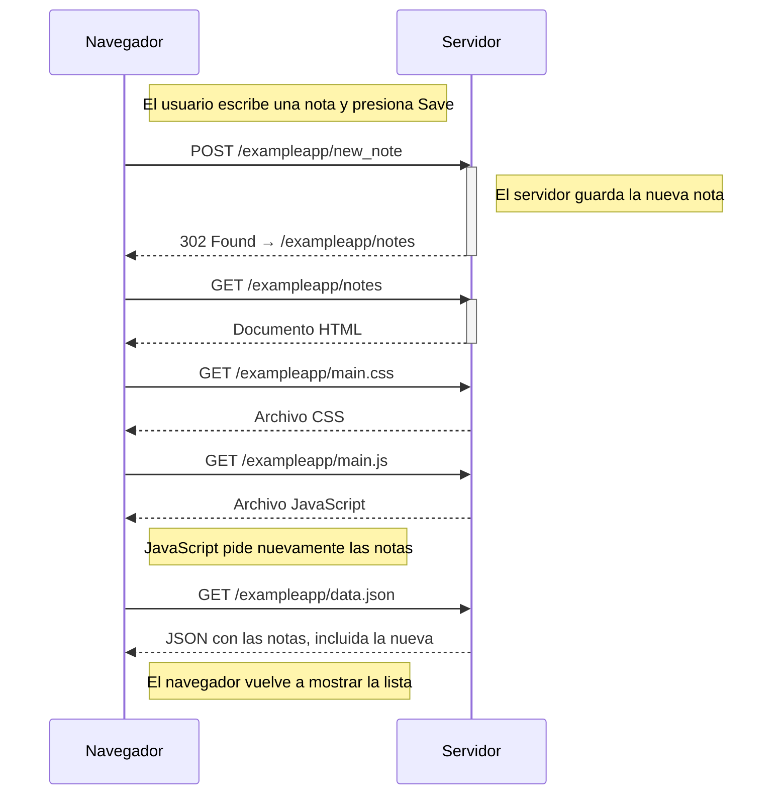

# 0.4 — Nueva nota

En la versión tradicional, al guardar una nota el formulario manda los datos al servidor. El servidor guarda la nota y responde con una redirección, por eso el navegador vuelve a cargar la página de notas y sus recursos.

La diferencia importante es que después del `POST` hay una redirección y se vuelve a cargar la página.
