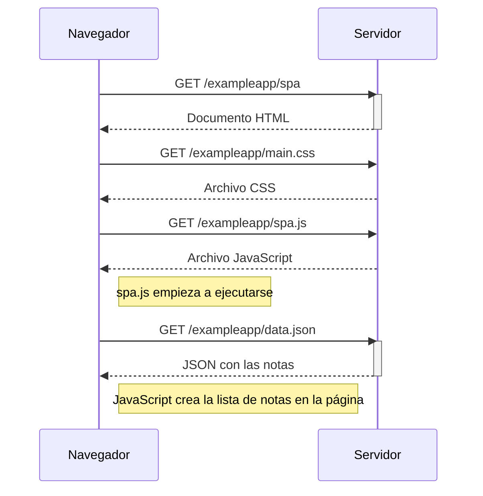

# 0.5 — Aplicación de una sola página

Cuando entro a la versión SPA, el navegador carga una sola página HTML junto con el CSS y el JavaScript. Después `spa.js` pide las notas al servidor y las dibuja en la página.

Acá el servidor entrega los datos, pero JavaScript se encarga de generar la vista de las notas en el navegador.
