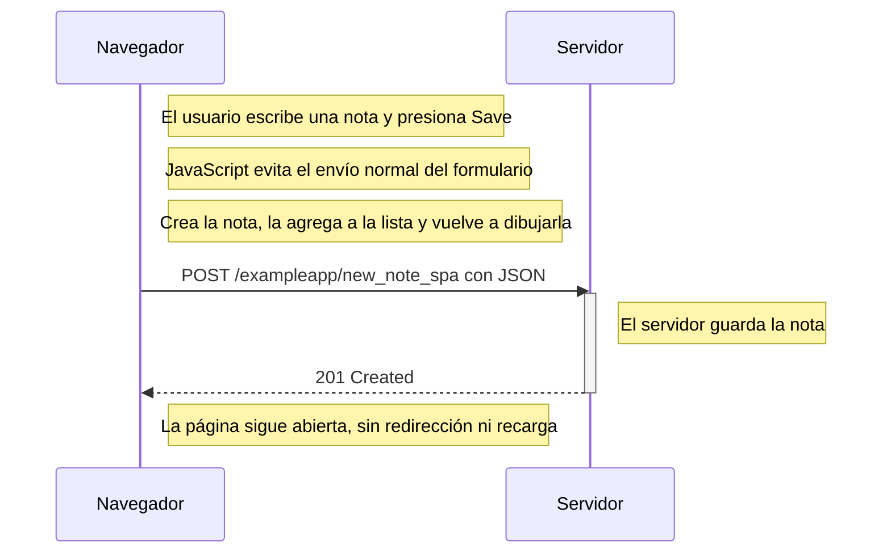

# 0.6 — Nueva nota en una SPA

En la SPA el formulario no provoca una recarga completa. JavaScript intercepta el envío, crea la nota, actualiza la lista que se ve en pantalla y después manda la nueva nota al servidor como JSON.

La parte que más cambia con respecto al ejercicio 0.4 es que no aparece un `302` ni un nuevo `GET` de la página. La vista se actualiza directamente desde JavaScript.
