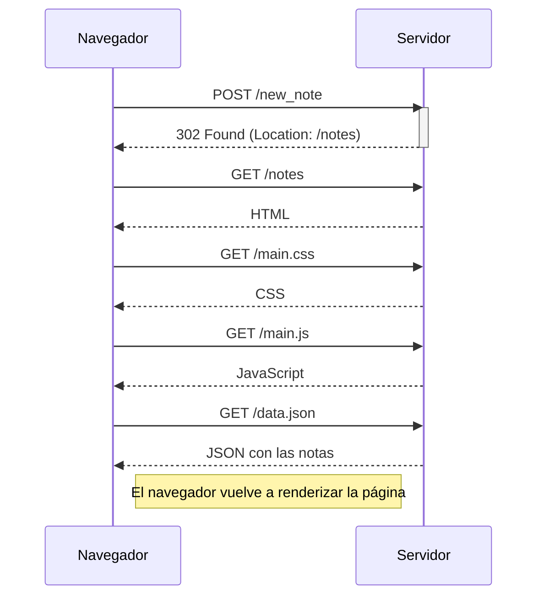
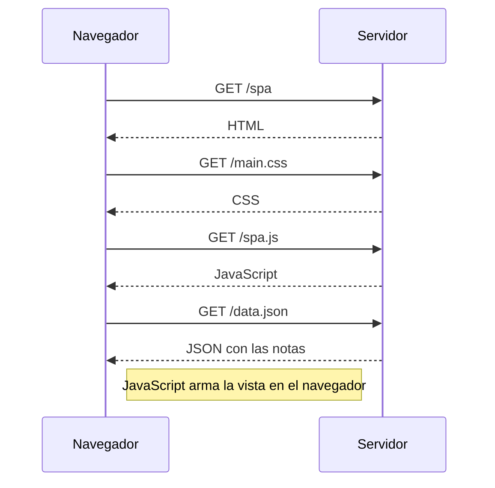
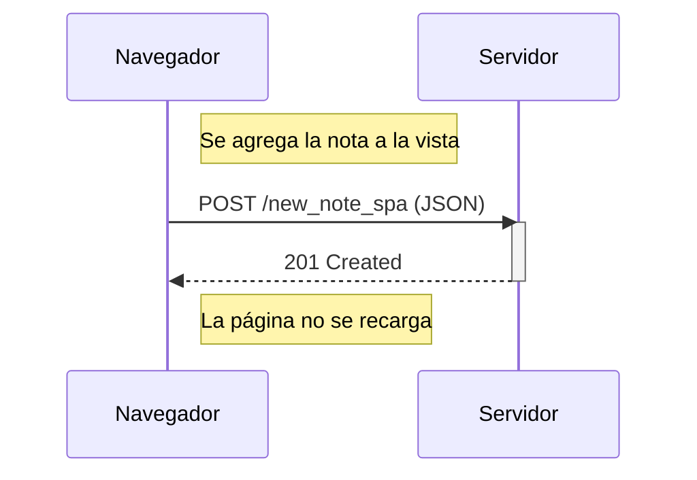

# Parte 0 — Fundamentos de aplicaciones web

En esta parte trabajé principalmente con el funcionamiento básico de una aplicación web: qué pide el navegador, qué responde el servidor y qué cambia cuando la aplicación funciona como una SPA.

Los ejercicios 0.4, 0.5 y 0.6 están representados con diagramas de secuencia en Mermaid para poder verlos directamente desde GitHub.

## 0.4 — Nueva nota en la aplicación tradicional

Cuando se envía el formulario, el navegador hace un `POST`. El servidor guarda la nota y responde con una redirección. Después el navegador vuelve a pedir la página y sus recursos.

## 0.5 — Carga inicial de la SPA

En la versión SPA se carga el HTML, el CSS y el JavaScript. Después el navegador pide los datos y JavaScript se ocupa de construir la vista sin depender de una recarga completa de la página.

## 0.6 — Nueva nota en la SPA

Acá la diferencia principal es que la nueva nota se agrega desde JavaScript y se manda al servidor en formato JSON. No hace falta redirigir ni volver a descargar todo el HTML.

