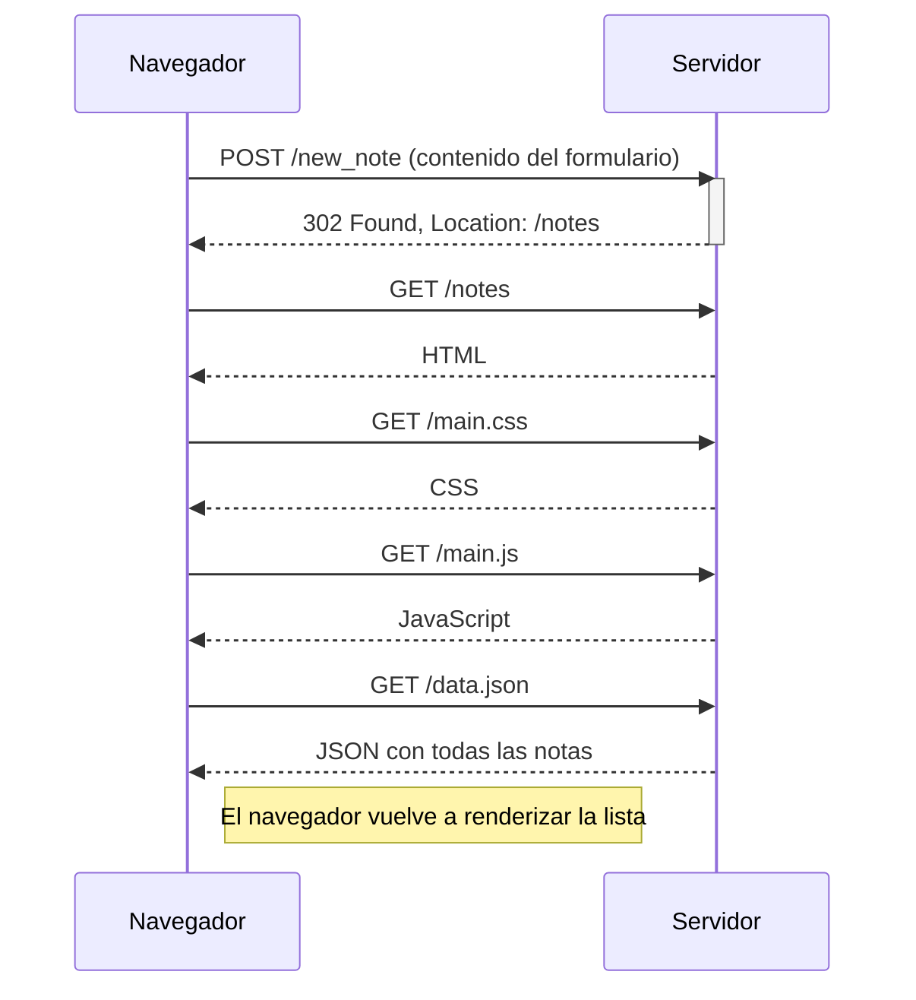
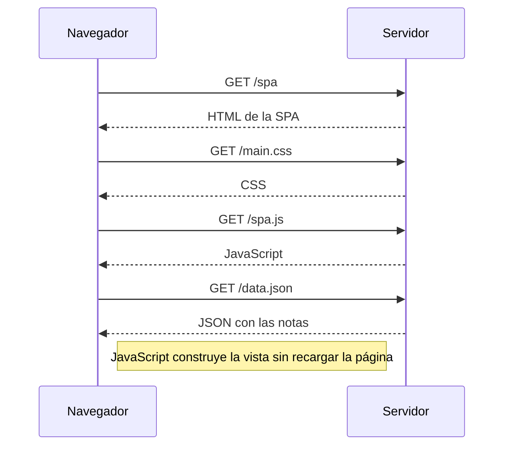
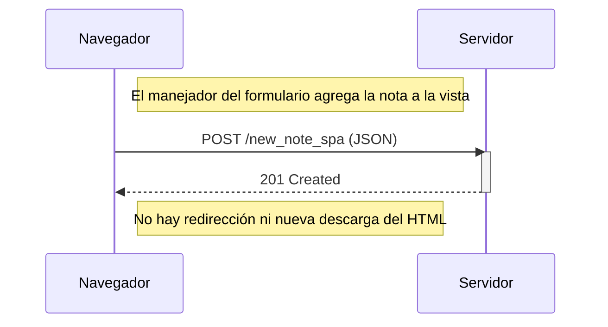

# Parte 0 — fundamentos de aplicaciones web

Los tres diagramas representan los ejercicios 0.4, 0.5 y 0.6. Se usa sintaxis Mermaid para que GitHub pueda renderizarlos directamente.

## 0.4 — crear una nota en la aplicación tradicional

## 0.5 — abrir la versión SPA

## 0.6 — crear una nota en la SPA

